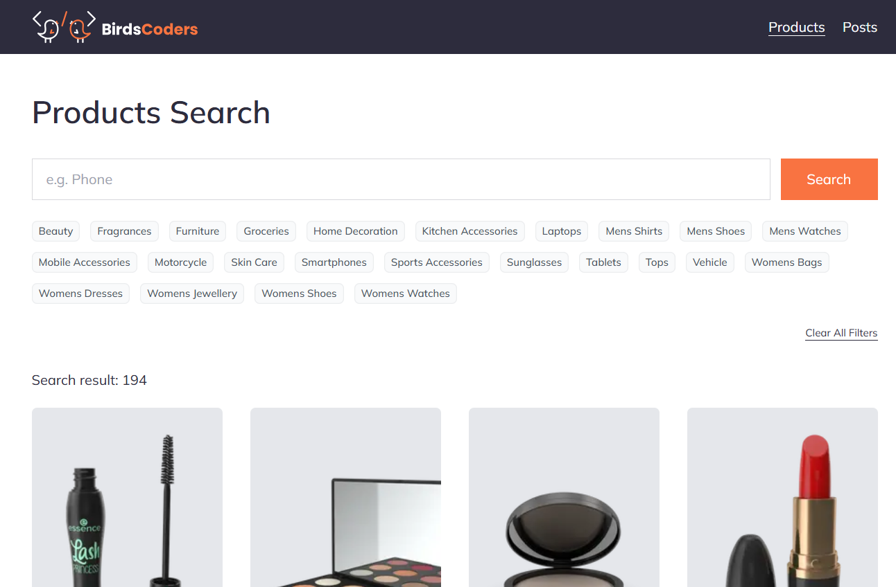

# Next.js 15 Search

This is an interactive project that includes search functionality for various entities, allowing users to filter by categories, keywords, and pagination.

The project bootstrapped with [`create-next-app`](https://nextjs.org/docs/app/api-reference/cli/create-next-app) and uses Next.js 15 with Tailwind CSS and [DummyJson](https://dummyjson.com/docs/products).

## Getting Started

Install dependencies:

```bash
npm install
```

Run the development server:

```bash
npm run dev
```

Open [http://localhost:3000](http://localhost:3000) with your browser to see the result.

Run the production server:

```bash
npm run build
npm run start
```

Run linting:

```bash
npm run lint
```

## Next.js documentation

To learn more about Next.js, take a look at the following resources:

- [Next.js Documentation](https://nextjs.org/docs) - learn about Next.js features and API.
- [Learn Next.js](https://nextjs.org/learn) - an interactive Next.js tutorial.

## How it looks like


